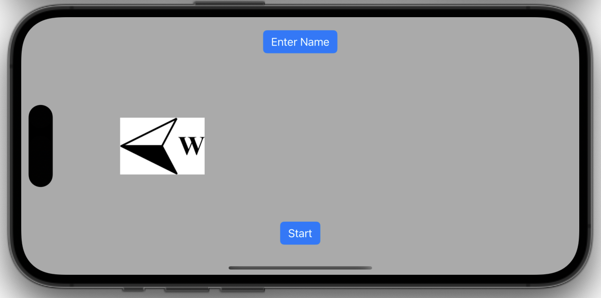
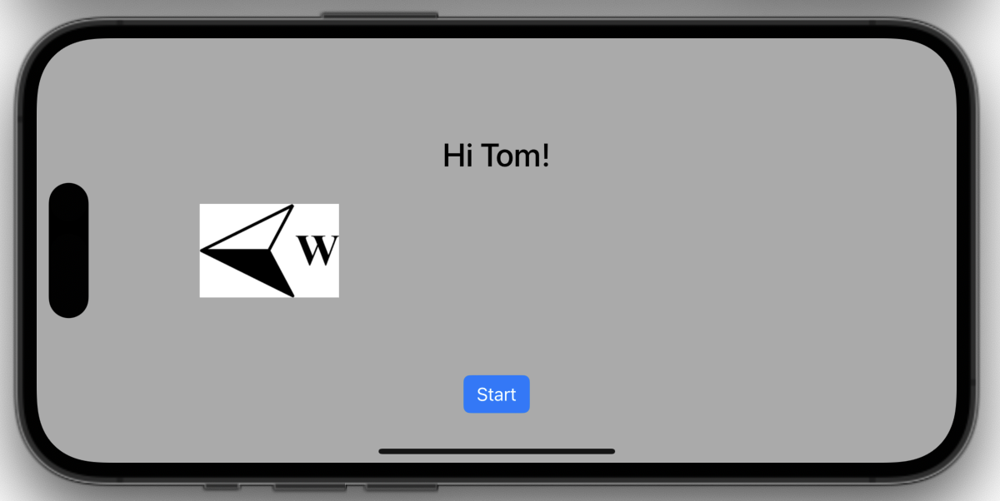
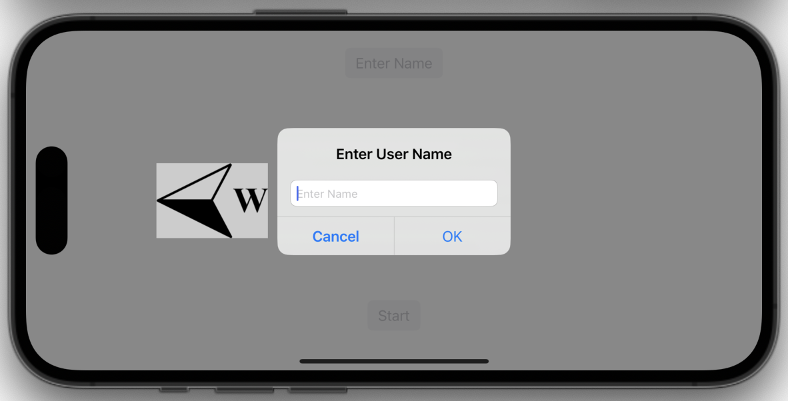
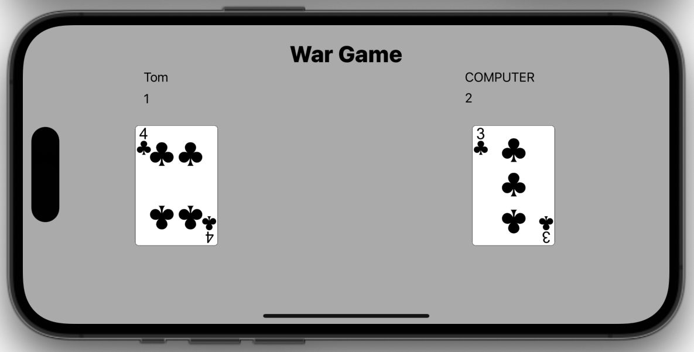
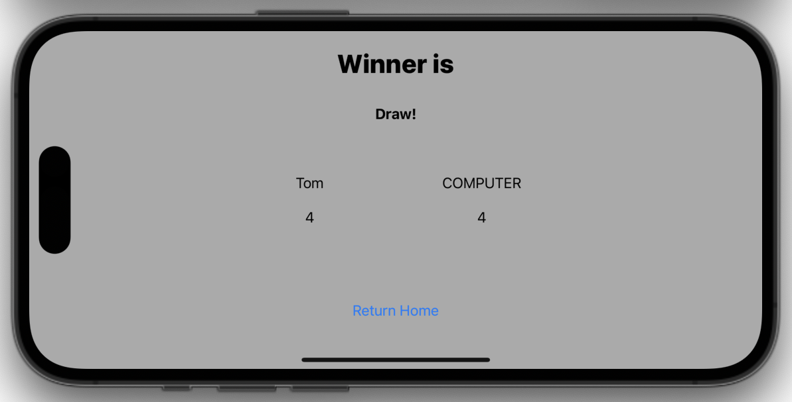
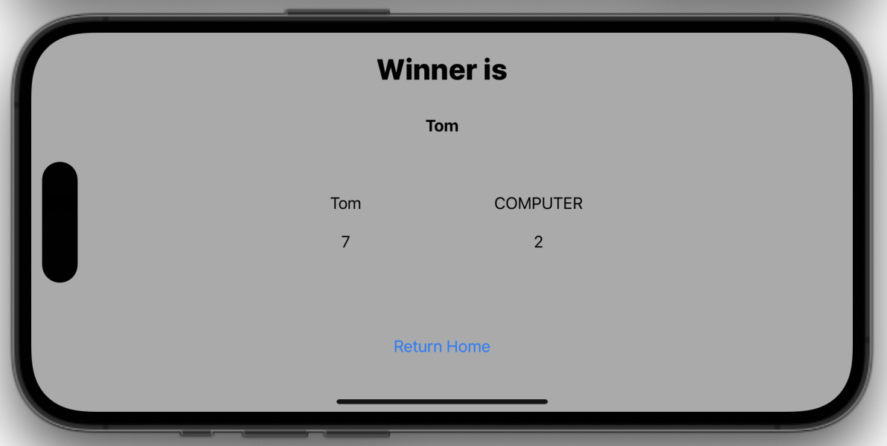

# Card Game

This is a simple card game iOS application written in Swift. The game involves two players, a user and a computer, who compete against each other by flipping cards and comparing their values. The player with the higher card value earns a point. The game continues for ten rounds, after which the final scores are displayed, and a winner is declared.

## Functionality

-   Allows the user to enter their name or use a previously saved name.
- Presents an alert where the user can enter their name. The name must consist of alphabetic characters only and cannot be empty.
-   Saves the user's name using UserDefaults for future sessions.
-   Displays a random image indicating the left or right side of the screen, determining the player's position in the game.

